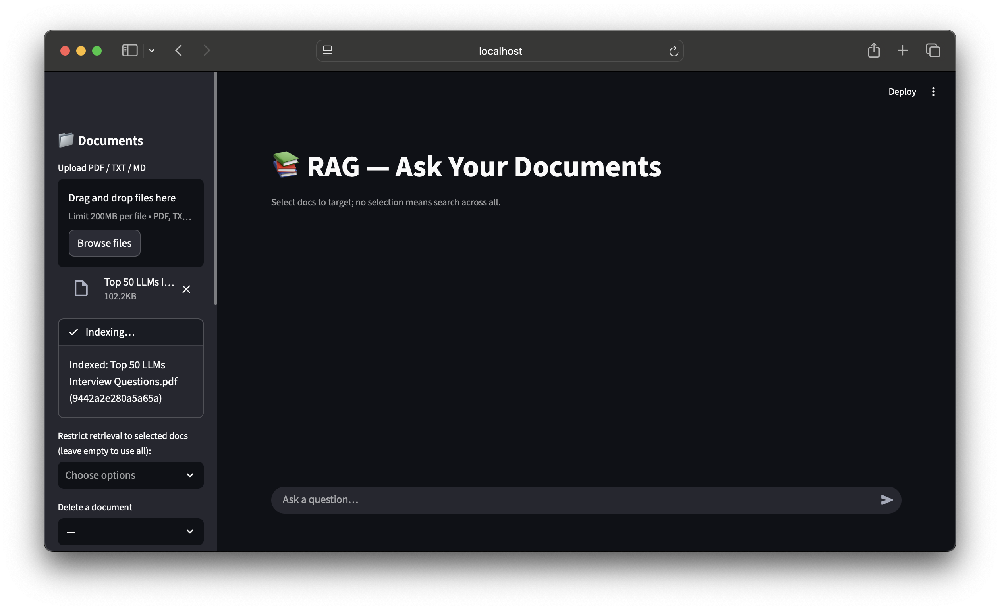
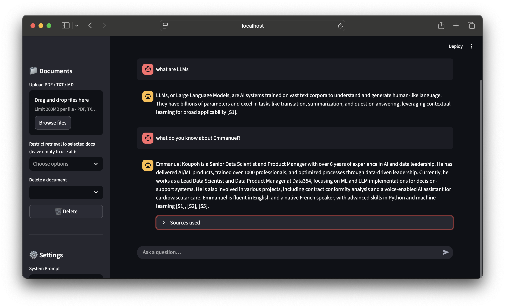
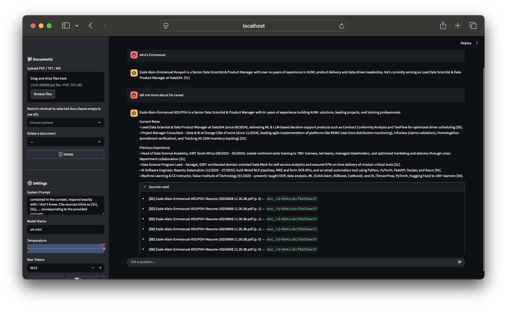
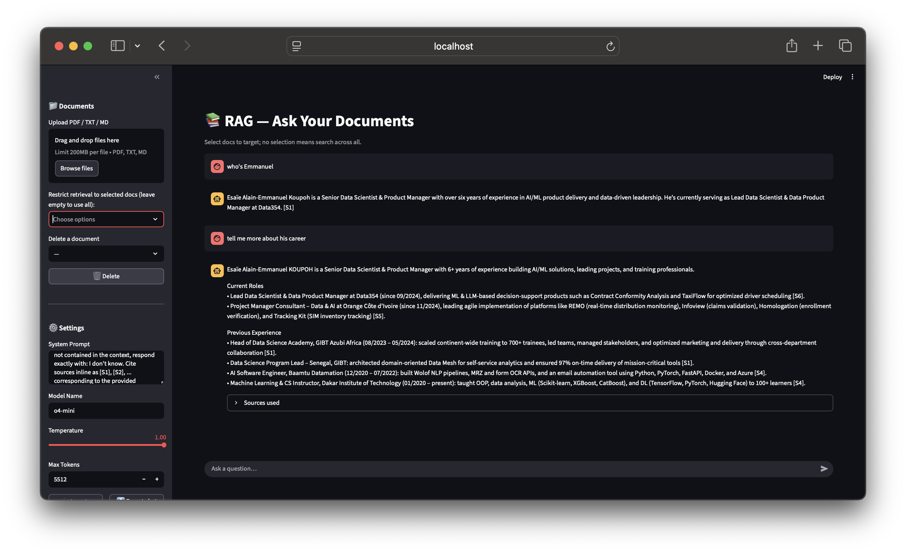
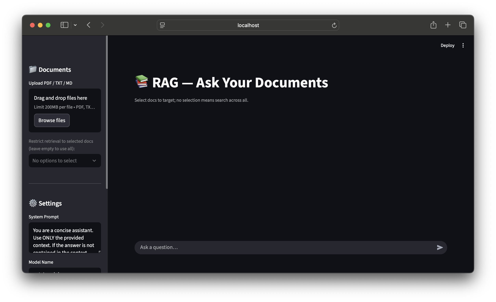

# 📚 Streamlit RAG — Select Docs or Search All



Production-ready RAG app built with **Streamlit + LangChain**, featuring:
- **Document selection**: target one/many docs—or search **all** when none selected
- **True streaming** responses
- **Inline citations** `[S1] [S2] …`
- Local **Chroma** vector DB with persisted storage

---

## ✨ Features

- Upload **PDF/TXT/MD**; chunks auto-embedded
- Restrict retrieval to selected docs from the sidebar
- Answers stream live; show sources used
- Export chat transcript as JSON
- Provider-agnostic LLM via `init_chat_model`; OpenAI embeddings by default

---

## 🗂️ Project Structure

```

.
├── app.py
├── assets/
│   └── imgs/
│       ├── api_key_added.png
│       ├── chat_with_gpt-4o-mini.png
│       ├── chat_with_o4-mini.png
│       ├── doc_added.png
│       └── source_used.png
├── chroma/
│   ├── chroma.sqlite3
├── data/
│   ├── `...`.pdf
│   └── registry.json
├── LICENSE
├── rag_store.py
├── readme.md
└── requirements.txt

````

---

## 🚀 Quickstart

### 1) Environment

- Python **3.10+**

```bash
python -m venv .venv
# macOS/Linux
source .venv/bin/activate
# Windows
# .venv\Scripts\activate
pip install -r requirements.txt
````

### 2) Configure API keys

This app uses:

* **LLM** via `init_chat_model` (e.g., `gpt-4o-mini`)
* **OpenAI Embeddings** (`text-embedding-3-small`)

Set **OPENAI\_API\_KEY** in env or Streamlit secrets.

**Env var**

```bash
export OPENAI_API_KEY="sk-..."
```

**.streamlit/secrets.toml**

```toml
OPENAI_API_KEY = "sk-..."
```

### 3) Run

```bash
streamlit run app.py
```

---

## 🧭 Using the App

1. **Upload** PDF/TXT/MD in the sidebar (they’re chunked + embedded).
   

2. **Select documents** (optional). If none selected, the query searches **all** indexed docs.

3. Ask your question in the chat. Answers **stream** and **cite** sources.
   

4. Expand **Sources used** to see what passages grounded the answer.
   

> Works with any `init_chat_model` provider; example with o4-mini:
> 

If the answer isn’t in the retrieved context, the model responds: **`I don't know`**.

---

## ⚙️ Configuration Cheatsheet

In the **sidebar**:

* **System Prompt** — controls assistant behavior; enforces grounded answers + `I don't know`.
* **Model Name** — e.g., `gpt-4o-mini`; any `init_chat_model`-supported model.
* **Temperature** — creativity vs determinism.
* **Max Tokens** — cap per response.
* **Clear chat** — reset memory.
* **Export chat** — download `.json` transcript.

---

## 🧩 How It Works

* **Indexing (`rag_store.py`)**

  * Loads files with `PyPDFLoader` / `TextLoader`
  * Splits with `RecursiveCharacterTextSplitter` (defaults: `CHUNK_SIZE=1000`, `CHUNK_OVERLAP=200`)
  * Embeds chunks (OpenAI) → stores in **Chroma** (persisted under `./chroma`)
  * Maintains a simple **registry** (`./data/registry.json`) with `{doc_id, name, path, num_chunks, created_at}`

* **Retrieval**

  * If you select docs: filter by `doc_id`
  * Otherwise: search across all
  * Top-k defaults to 6 (see `store.get_retriever(... k=6)`)

* **Prompt / Chain**

  * LCEL pipeline: `ChatPromptTemplate(system + history + human)` → `init_chat_model(streaming=True)` → `StrOutputParser`
  * Context string includes numbered snippets `[S1] [S2] …` so the model can cite cleanly

* **Citations**

  * UI displays a compact list: `[S#] name (p. X) • doc_id`

---

## 🔧 Customization

Open `rag_store.py` to tweak:

* **Chunking**

  * `CHUNK_SIZE`, `CHUNK_OVERLAP`
* **Embeddings**

  * Replace `OpenAIEmbeddings` in `openai_embeddings()` with another provider
* **Vector store**

  * Swap Chroma for another LangChain-supported store

Open `app.py` to tweak:

* **Defaults**: model, temperature, max tokens, system prompt
* **Retrieval k**: change `k=6` in `get_retriever(...)`
* **Policies**: extend the system prompt / add guardrails

---

## 🧪 Troubleshooting

* **API key hint** appears for `gpt-*` models if `OPENAI_API_KEY` is missing:
  

* If generation fails:

  * Verify **model name** matches your provider
  * Confirm **OPENAI\_API\_KEY** is set
  * Reduce **Max Tokens** if you hit limits

---

## 🔒 Security Notes

* Keep keys in env or secrets—never commit them.
* Be mindful of sensitive document content.
* Review provider limits and data policies.

---

## ❓ FAQ

**Why does it say “I don't know”?**
The system prompt enforces grounded answers. If context doesn’t contain the answer, it returns **I don't know**.

**Can I persist chat memory across restarts?**
Current memory is session-scoped. Persist it by writing to a DB or file per session.

**How do I remove a document?**
Use the **Delete** control in the sidebar. It removes vectors and the file (if present), and updates the registry.

---

## 📦 Requirements

```
streamlit                 ==1.49.1
langchain                 ==0.3.27
langchain-core            ==0.3.75
langchain-openai          ==0.3.32
langchain-chroma          ==0.2.5
langchain-community       ==0.3.29
pypdf                     ==6.0.0
```

---

## 🤝 Contributing

PRs welcome. Keep changes focused and documented.

---

## 📝 License

MIT — see `LICENSE`.